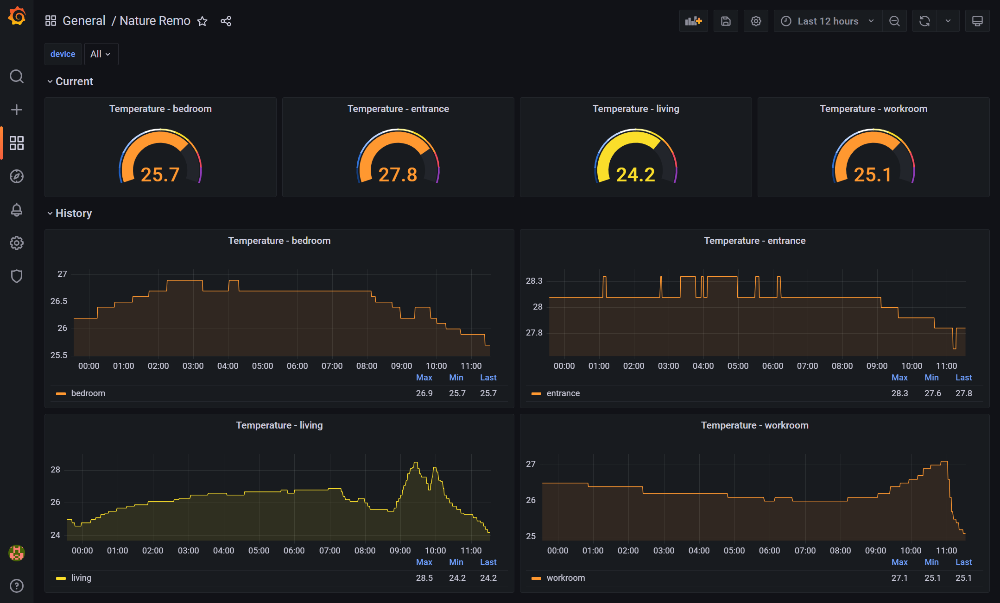
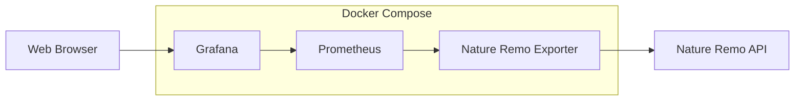

# Overview



This docker stack provides a Grafana dashboard showing historical temperature data from your Nature Remo devices.
It includes a custom Nature Remo exporter written in Python.
All you need to run this stack is three steps.

# Architecture



# Prerequisites

- Nature Remo API token
  - Login Page URL : https://api.nature.global/login
  - Select only the 'Basic' scope.
  - The generated token will be used in the Setup section.
- Docker Environment
  - Docker (verified with 29.5.0)
  - Docker Compose v2 or later (verified with v5.1.3)
- Git

# Setup

## Clone repository from GitHub
```
$ git clone https://github.com/t74ops/prometheus-monitoring-stack.git
$ cd prometheus-monitoring-stack
```

## Create .env file

### Copy the sample file

```
$ cp nature-remo-exporter/.env.example nature-remo-exporter/.env
```

### Edit the .env file with your text editor

```
NATURE_REMO_TOKEN=your_token_here
```
Replace 'your_token_here' with your generated token.

## Run docker compose command

```
$ docker compose up -d
```

## Login

- Access 'http://localhost:3000' on your Web browser
- Username: admin
- Password: admin
- Grafana will prompt you to change the password. You can either set a new password or skip this step.

# Design decisions

## Secrets passed at runtime

The API token is not included in the docker image. Instead, it is provided through the .env file at runtime.
This means you can replace the token without re-building the image.

## Named volumes instead of bind mounts

To achieve data persistence, this stack uses named volumes instead of bind mounts.
Named volumes avoid the file ownership issues that bind mounts cause.
With bind mounts, additional steps such as chown will be needed.

## Fixed uid for datasource

Datasource uid is a fixed value in the 'nature-remo.json' file.
So you don't have to set datasource configuration on the GUI.
If uid is not fixed for keeping portability, additional operation will be needed.

## Scrape interval

The Nature Remo API is rate-limited to 30 requests per 5 minutes.
Prometheus queries the Nature Remo exporter every 60 seconds with a safety margin. The default value is 15 seconds. With the default value, it is likely to hit the limitation if other clients also call the same API. As a result, the API returns HTTP 429. 

## Zero manual setup

All configuration files for Grafana to achieve automated provisioning are included. This provides you the dashboard without any manual operation steps. If those files are not included, you need to import the dashboard and set datasource after starting the Grafana container.

# Limitations

- Humidity and illuminance sensors are not supported in the current version.
- No automated tests are included.
- Devices without a temperature sensor cause an error.

